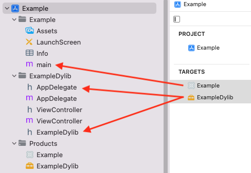
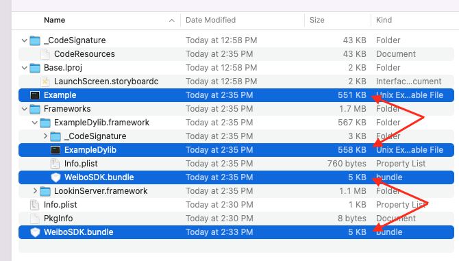
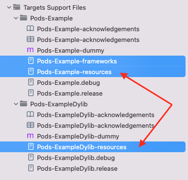
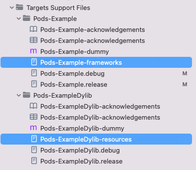
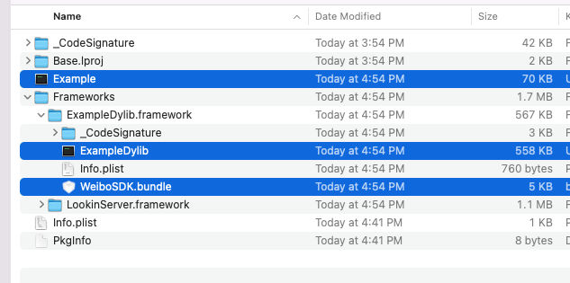

### Duplicate classes warnings at runtime when multiple targets are contained in the same project

示例项目 Example，新建 target ExampleDylib，主 target 只保留 main 函数，所有业务逻辑迁移到 ExampleDylib。

```ruby
target 'Example' do

end

target 'ExampleDylib' do
  pod 'Masonry'
  pod 'LookinServer'
  pod 'Weibo_SDK'
end
```

业务依赖取 3 种典型：Masonry 全源码(.h + .m)，LookinServer 无代码，纯动态 (.framework)，WeiboSDK 静态库且带资源 (.h + .a + .bundle)





pod install 编译运行后遇到两个问题：1、大量的重复符号（所有 Masonry 中的 classs）

```bash
objc[46278]: Class MASConstraintMaker is implemented in both .../ExampleDylib.framework/ExampleDylib (0x100b26dd0) and .../Example.app/Example (0x1006c6e80). One of the two will be used. Which one is undefined.
...
```

2、资源文件冗余



Example 只含有一个 main 函数，体积却与 ExampleDylib 近似，即代码被重复 link。而 WeiboSdk.bundle 也被重复复制了一份。

从生成的复制资源的脚本有冗余也能印证这个问题。




网上搜索发现有同样的问题：

[Duplicate classes warnings at runtime when multiple targets are contained in the same project #7155](https://github.com/CocoaPods/CocoaPods/issues/7155)

给出的 workaround 是：

```ruby
pre_install do |installer|
  embedded_target = installer.aggregate_targets.find { |aggregate_target| aggregate_target.name == 'Pods-Framework' }
  host_target = installer.aggregate_targets.find { |aggregate_target| aggregate_target.name == 'Pods-App' }
  host_target.pod_targets = host_target.pod_targets - embedded_target.pod_targets
end
```

配合 cocoapods (1.11.2) 试了下无效，需做适当修改：

```ruby
pre_install do |installer|
  host_target = installer.aggregate_targets.find { |aggregate_target| !aggregate_target.requires_host_target? }
  host_target.user_build_configurations.keys.each do |config|
    host_target.pod_targets_for_build_configuration(config).delete_if { |pod_target| pod_target.framework_paths.values.flatten.empty? }
  end
end
```

效果：



可以看到少了个冗余的 Pods-Example-resouces.sh



产物中 Example 体积恢复正确，WeiboSdk.bundle 也只保留一份。


原理是，先选出 host target 即 Pod-Example，把它依赖的 pod_targets 清空（避免了重复 link 与冗余资源），但需要保留 LookinServer.framework 这类动态库依赖。因为目前的 pod 逻辑中，ExampleDylib 依赖的 framework 是靠 Example 来嵌入。细节可参考这里：

```ruby
add_embed_frameworks_script_phase
remove_embed_frameworks_script_phase_from_embedded_targets
```